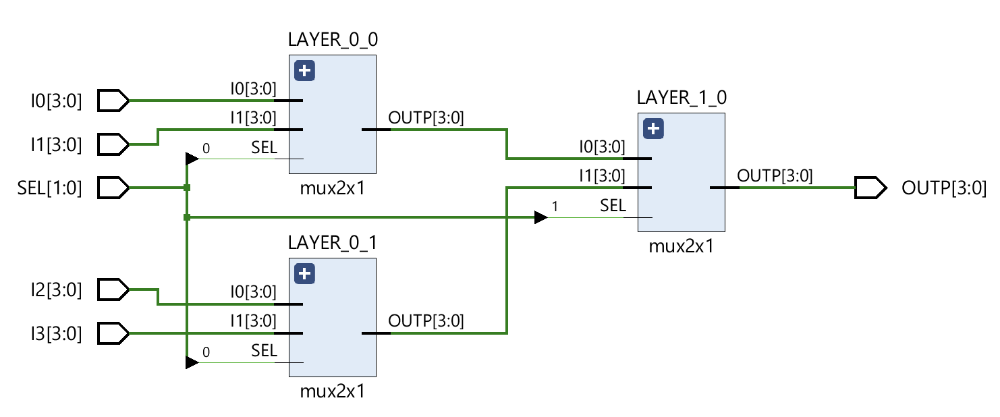

# 4x1 Multiplexer

This project is part of my initiative to accelerate my digital design knowledge by creating and implementing systems discussed at a theoretical level in classes to ultimately become proficient at RTL design.

# Theory:

A Multiplexer (MUX) is a combinational circuit that has maximum of 2^n data inputs, ‘n’ selection lines and single output line. One of these data inputs will be connected to the output based on the values of selection lines. Since there are ‘n’ selection lines, there will be 2^n possible combinations of zeros and ones. So, each combination will select only one data input.

A 4x1 Multiplexer (MUX) takes four different inputs and gives one of the inputs as the single output. This is determined by the select signal of the MUX, which is 2 bits. A 2x1 MUX takes two inputs and has a one bit select signal to choose between the inputs.

# Implementation:

Overall we need three 2x1 MUX to create a 4x1 MUX. The first layer of MUXs will take the four inputs (two each). Then both MUX's will output into the input of the last 2x1 MUX, which is the second layer. As well, only one select signal is needed for the first layer as the select signal on the second layer will determine which input is passed through.

We can easily use a hierarchical structure in VHDL to define a 2x1 MUX on its own and then instantiate the component in the architechture of the 4x1 MUX. All of the behaviour for the 4x1 system is already defined and just needs to be correctly connected using the port mapping. This creates a simple and clean design that is easy to edit and expand on. I found the system much easier to implement with a schematic in mind when connecting the 2x1 MUXs together, shown below.

From the testbench: I0 = 0001, I1 = 0010, I2 = 0100, I3 = 1000
